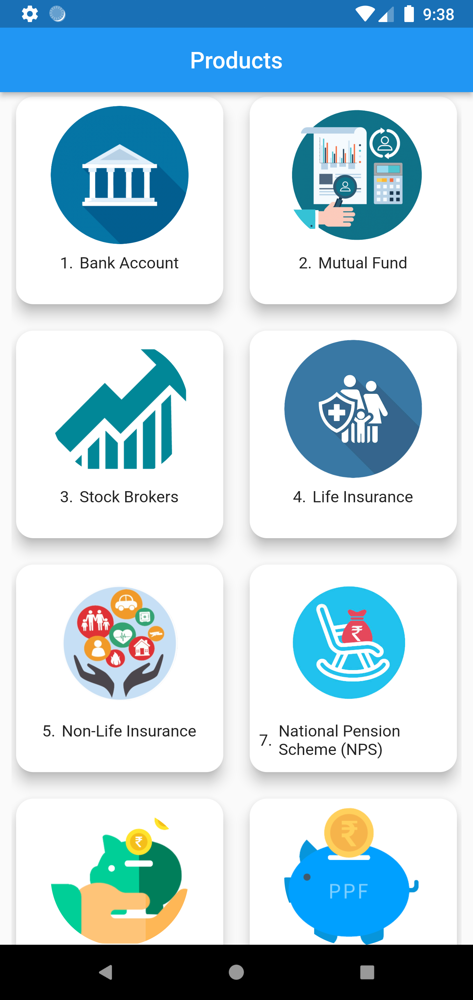

# flutter_assignment

Flutter Assignment - Design the single -page Flutter application.

## Getting Started

1. It is a single page flutter project which will display the products that are present in the database which will be fectched using REST API.
2. For making http requests http: ^0.13.5 SDK is used.
3. Data is shown in the homepage using GridView and Crad widget.

   

